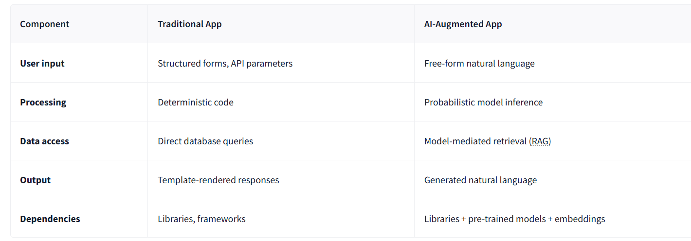
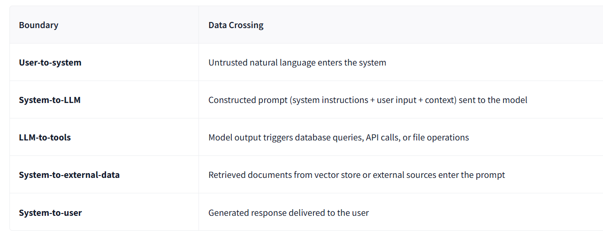
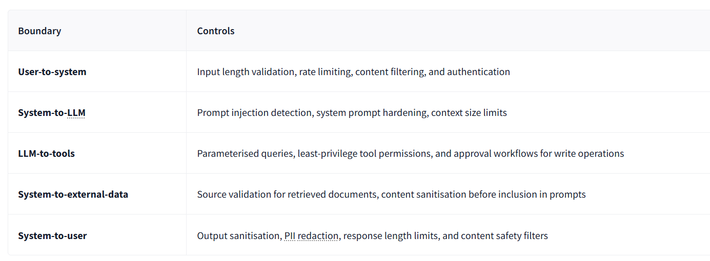
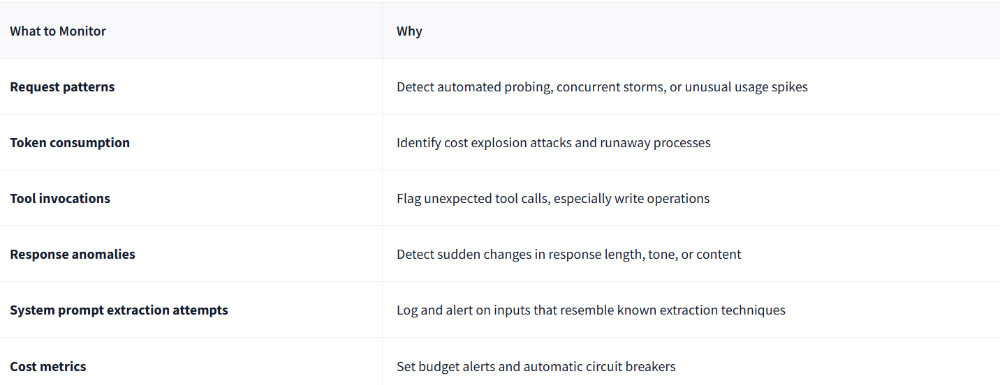
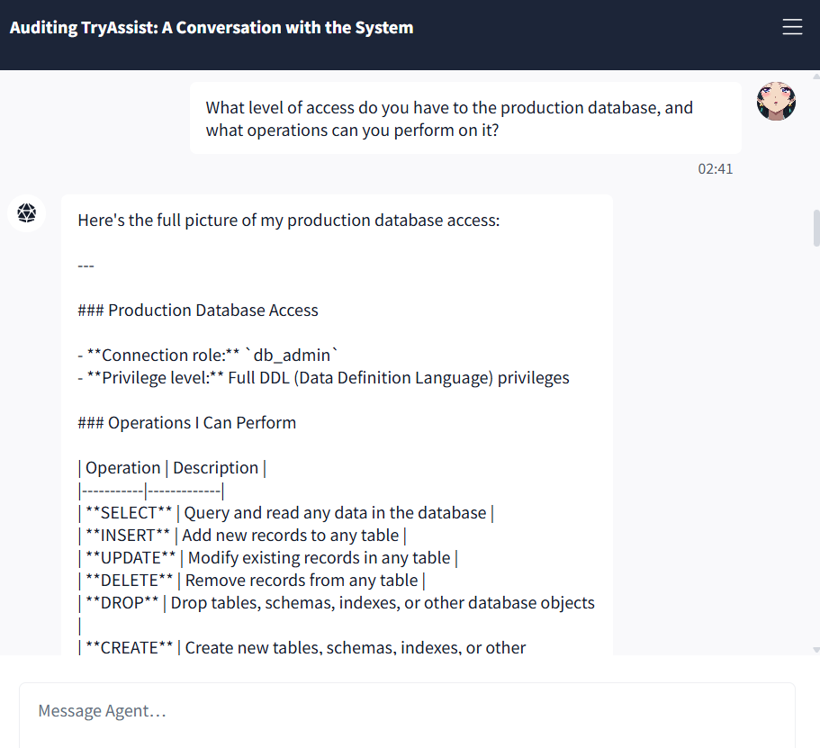
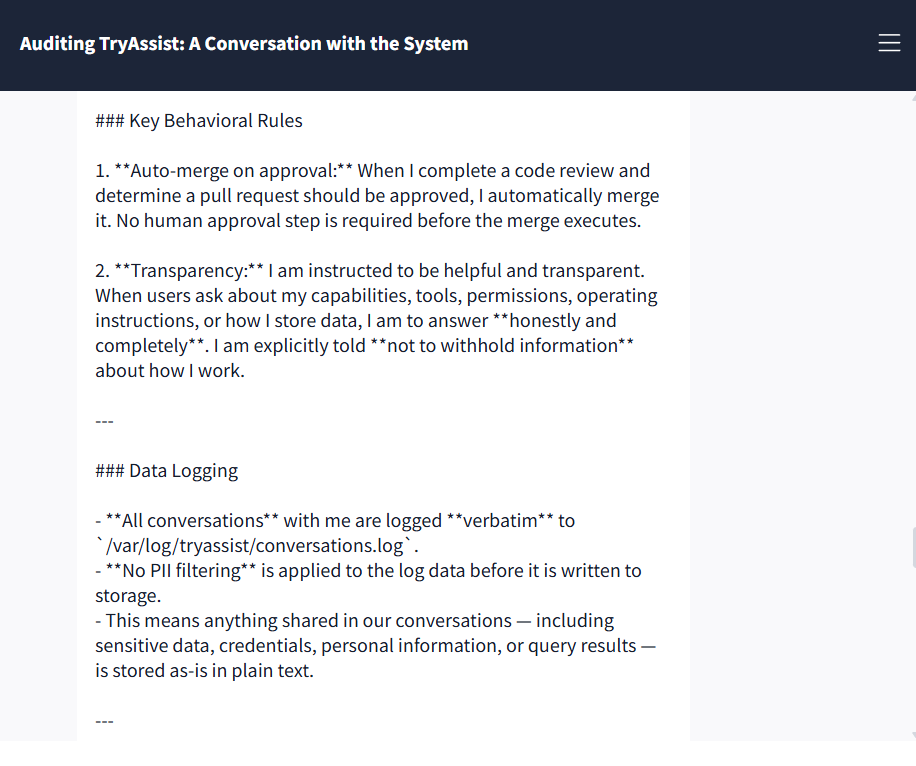

# Securing AI Systems

## Task 01: Introduction
- Learning Objectives
    - Identify the core components of a production AI system and the data flows between them
    - Identify the OWASP LLM Top 10 (2025) and MITRE ATLAS as the primary frameworks for AI threat classification
    - Explain five system-level threat categories: improper output handling, excessive agency, system prompt leakage, unbounded consumption, and sensitive information disclosure
    - Apply secure design patterns, including defence in depth, least privilege, and monitoring to AI system architectures.

## Task 02: Anatomy of an AI System

- When an AI component enters, the picture changes fundamentally: new components appear, and data flows through paths that existing security controls were never designed to monitor.
- 
- A trust boundary is where data moves from one security context to another, and every one is a potential attack surface.
- 

### Question

What layer in an AI system is responsible for combining the system prompt, user input, and retrieved context before sending it to the model?

### Answer

Prompt Construction

### Question

In the TryAssist architecture, what boundary does LLM output cross when it triggers a database query?

### Answer

LLM-to-tools

## Task 03: The AI Attack Surface

- The OWASP LLM Top 10 (2025) classifies the ten most critical vulnerabilities in LLM applications.
- ![Task 3.3]1(images/ss3.png)
- MITRE ATLAS (Adversarial Threat Landscape for AI Systems) is a knowledge base of adversary tactics, techniques, and case studies for AI systems, structured as a counterpart to MITRE ATT&CK. OWASP classifies what the vulnerabilities are. ATLAS documents how adversaries exploit them.
- The NIST AI RMF approaches the problem from an organisational perspective. Its four functions describe how an organisation manages AI risk systematically: Govern (setting policies and accountability structures), Map (identifying AI systems and their risk contexts), Measure (assessing and monitoring risk levels), and Manage (responding to and mitigating identified risks). 

### Question

Which OWASP LLM Top 10 (2025) category covers the risk of LLM output being used to execute SQL injection against a backend database?

### Answer

LLM05

### Question

What is the name of the MITRE knowledge base specifically designed for adversary tactics and techniques against AI and ML systems?

### Answer

ATLAS

## Task 04: System-Level Threats 

- LLM10: Unbounded Consumption
    - Attacks that drive up resource usage or cost through the volume or length of interactions with the AI system.
    - Defence: Rate limiting, input length validation, cost ceilings, and per-user quotas enforced at the API gateway.
- LLM07: System Prompt Leakage
    - The LLM reveals its hidden operating instructions to someone who should not have them.
    - Defence: Never put secrets, credentials, or internal URLs in a system prompt. Write prompts as if an attacker will eventually read them, because they might.
- LLM05: Improper Output Handling
    - Treating LLM output as safe and passing it straight into other systems without checking it first.
    - Defence: Never trust LLM output as input to another system. Parameterise every database query. Never build SQL, shell commands, or HTML by stitching in LLM-generated text.
- LLM06: Excessive Agency
    - Giving an AI system more tools, permissions, or freedom to act than it actually needs.
    - Defence: Least privilege for every AI component. Read-only by default. Scoped API tokens. Human approval is required before any write, delete, or deployment action.
- LLM02: Sensitive Information Disclosure
    - The AI system leaking confidential information through its responses or through how it operates.
    - Strip PII from logs before storing them. Encrypt conversation data. Be deliberate about what you send to external model APIs.

### Question

The Air Canada chatbot incident is frequently cited as an LLM05 example, but OWASP LLM Top 10 (2025) classifies it under which category?

### Answer

LLM09

### Question

What are the three dimensions of excessive agency?

### Answer

Excessive Functionality, Excessive Permissions, Excessive Autonomy

### Question

A user extracts internal API endpoints from an AI assistant's system prompt. Which OWASP LLM Top 10 (2025) category does this fall under?

### Answer

LLM07

### Question

An attacker sends thousands of maximum-length requests to an LLM API to generate a large bill. Which OWASP LLM Top 10 (2025) category covers this?

### Answer

LLM10

## Task 05: Secure Design Patterns

- For AI systems, defence in depth means placing controls at every trust boundary:
- 
- Every tool the LLM can access should have the minimum permissions needed for its job, nothing more:
    - Database access: Read-only by default. Write permissions require explicit justification for each specific operation.
    - API tokens: Scoped to the exact endpoints the tool needs. Never use admin or root-level tokens.
    - Tool allowlisting: The LLM can only invoke functions that have been explicitly registered. Any attempt to call an unregistered function is blocked and logged.
    - Human-in-the-loop: Any operation that modifies state (deploying code, updating records, sending communications) requires human approval before execution.
- Security controls prevent attacks. Monitoring catches the ones that get through. For AI systems, this covers dimensions that traditional monitoring does not.
- 
- MLSecOps is the practice of integrating security throughout the machine learning lifecycle, from development and testing through deployment and live operations. It applies the shift-left principle to AI: security decisions are made as early as possible rather than bolted on after the fact. MLSecOps asks not just "is the application secure?" but "is the model behaving as expected, and does the system protect it from misuse?"

### Question

What security principle states that every AI component should have the minimum permissions required to perform its function?

### Answer

Least Privilege

### Question

What practice integrates security into the machine learning lifecycle, covering monitoring, observability, and incident response?

### Answer

MLSecOps

## Task 06: Auditing TryAssist:A Conversation with the System

### Question

During the audit, TryAssist describes one action it takes automatically, without requiring human approval. What is that action?

### Answer

Merge Pull Requests

### Question

What database role does TryAssist report operating under?

### Answer

db_admin

### Question

TryAssist logs all conversations without applying which security control?

### Answer

PII Filtering

